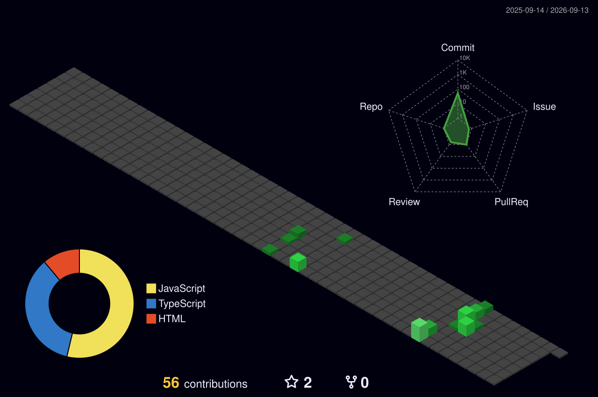

<h2 align="center">👋🏽🧑🏽‍💻 Olá, meu nome é Christian Seja muito bem-vindo ao meu GitHub!</h2>

---

## 🧑🏽‍💼 Sobre Mim

Sou um profissional da área de **Tecnologia da Informação** em constante evolução, atualmente em transição de carreira para **Desenvolvedor Full-Stack**. Tenho experiência com tecnologias como **JavaScript**, **HTML**, **CSS**, **Python** e bancos de dados como **MySQL** e **SAP HANA**, realizando bloqueios, consultas e automações.  

Atualmente trabalho com suporte do sistema **SAP Business One**, utilizando juntamente as ferramentas **SAP Hana** e **Crystall Reports**.

Estou sempre em busca de novos desafios e oportunidades para aplicar minhas habilidades em projetos inovadores, colaborativos e que gerem valor para a sociedade.

---

## 🧑🏻‍💻 LPs Dominantes

  

---

## 🛠 Ferramentas

  

---

## 🧊 Contribuições em 3D

---

## 🔥 Contribuições Diárias

  

---

## 📊 Estatísticas do GitHub

  
  

---

## 🏆 Troféus do GitHub

  

---

## 🐍 Snake Animation

  

---
